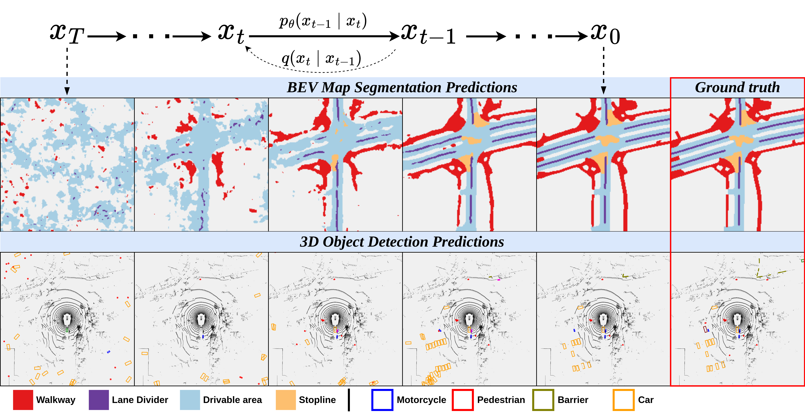

## DifFUSER: Diffusion Model for Robust Multi-Sensor Fusion in 3D Object Detection and BEV Segmentation
#### Duy-Tho Le, Hengcan Shi, Jianfei Cai, Hamid Rezatofighi

This repository contains the official implementation of the paper "DifFUSER: Diffusion Model for Robust Multi-Sensor Fusion in 3D Object Detection and BEV Segmentation" 




## News

- [2024/10] Code will be released soon.
- [2024/03] DifFUSER is accepted by ECCV 2024!!


## Introduction
This repository contains the official implementation of the paper "DifFUSER: Diffusion Model for Robust Multi-Sensor Fusion in 3D Object Detection and BEV Segmentation"

This project is based on the [BEVFusion](https://github.com/mit-han-lab/bevfusion) repository. We extend the BEVFusion with the DifFUSER module to improve the robustness of multi-sensor fusion in 3D object detection and BEV segmentation.

## Abstract
Diffusion models have recently gained prominence as powerful deep generative models, demonstrating unmatched performance across various domains. However, their potential in multi-sensor fusion remains largely unexplored. In this work, we introduce ``DifFUSER'', a novel approach that leverages diffusion models for multi-modal fusion in 3D object detection and BEV map segmentation. Benefiting from the inherent denoising property of diffusion, DifFUSER is able to refine or even synthesize sensor features in case of sensor malfunction, thereby improving the quality of the fused output. In terms of architecture, our DifFUSER blocks are chained together in a hierarchical BiFPN fashion, termed cMini-BiFPN, offering an alternative architecture for latent diffusion. We further introduce a Gated Self-conditioned Modulated (GSM) latent diffusion module together with a Progressive Sensor Dropout Training (PSDT) paradigm, designed to add stronger conditioning to the diffusion process and robustness to sensor failures. Our extensive evaluations on the Nuscenes dataset reveal that DifFUSER not only achieves state-of-the-art performance with a 70.04% mIOU in BEV map segmentation tasks but also competes effectively with leading transformer-based fusion techniques in 3D object detection.


## Installation

```html
git clone https://github.com/ldtho/DifFUSER.git
cd DifFUSER
conda create difFUSER python=3.9
conda install pytorch==1.10.0 torchvision==0.11.0 torchaudio==0.10.0 cudatoolkit=11.3 -c pytorch -c conda-forge
conda install cudatoolkit-dev ninja cuda-nvcc=11.3 numba cudnn fvcore libclang cmake lit gcc openmpi==4.0.4 tqdm pillow=8.4 timm setuptools=59.5 -c conda-forge -c nvidia -y
pip install mmcv-full==1.4.0 -f https://download.openmmlab.com/mmcv/dist/cu113/torch1.10.0/index.html
pip install nuscenes-devkit pyquaternion mmdet==2.20.0 torchpack==0.3.1 spconv-cu113 mpi4py==3.0.3 numpy==1.23 setuptools==59.5.0 wandb
python setup.py develop
```

## Data Preparation

Please follow the instructions from [here](https://github.com/open-mmlab/mmdetection3d/blob/master/docs/en/datasets/nuscenes_det.md) to download and preprocess the nuScenes dataset. Please remember to download both detection dataset and the map extension (for BEV map segmentation). After data preparation, you will be able to see the following directory structure (as is indicated in mmdetection3d):

```
mmdetection3d
├── mmdet3d
├── tools
├── configs
├── data
│   ├── nuscenes
│   │   ├── maps
│   │   ├── samples
│   │   ├── sweeps
│   │   ├── v1.0-test
|   |   ├── v1.0-trainval
│   │   ├── nuscenes_database
│   │   ├── nuscenes_infos_train.pkl
│   │   ├── nuscenes_infos_val.pkl
│   │   ├── nuscenes_infos_test.pkl
│   │   ├── nuscenes_dbinfos_train.pkl

```

### Evaluation

We also provide instructions for evaluating our pretrained models. Please download the checkpoints using the following script: 
    
```html
bash tools/scripts/download_pretrained_models.sh
```

For **BEV Segmentation**, you will be able to run:

```bash
torchpack dist-run -np [number of gpus] python tools/test.py [config file path] pretrained/[checkpoint name].pth --eval [evaluation type]

# Example

torchpack dist-run -np 8 python tools/test.py configs/nuscenes/seg/diffuser-seg.yaml pretrained/DifFUSER-seg.pth --eval map
```

For citation:

```html
@inproceedings{lediffusion,
  title={Diffusion Model for Robust Multi-Sensor Fusion in 3D Object Detection and BEV Segmentation},
  author={Le, Duy-Tho and Shi, Hengcan and Cai, Jianfei and Rezatofighi, Hamid},
  booktitle={European Conference on Computer Vision},
  year={2024}
}
```

